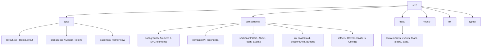

# ThinkTech — STEM Orator Society Website

<div align="center">

[](https://nextjs.org/)
[](https://react.dev/)
[](https://www.typescriptlang.org/)
[](https://tailwindcss.com/)
[](https://www.framer.com/motion/)
[](https://thinktech-srmuniversity.vercel.app/)

### Think. Speak. Lead.

The official premium digital platform for **ThinkTech — STEM Orator Society** (Faculty of Engineering and Technology). A modern, interactive web experience showcasing society milestones, core academic pillars, flagship events, and the community.

🌐 **Live Website**: [thinktech-srmuniversity.vercel.app](https://thinktech-srmuniversity.vercel.app/)

---

</div>

## 🌌 Theme & Visual Design System

The platform is designed to look futuristic, premium, and highly responsive, drawing inspiration from modern developer portals (like Vercel and Linear) with glassmorphic cards, smooth spring physics, and CSS-driven ambient lighting.

### 🎨 Color Palette & Variables
Configured dynamically within both [globals.css](file:///d:/Programming/react/Thinktech/src/app/globals.css) and [tokens.ts](file:///d:/Programming/react/Thinktech/src/lib/tokens.ts):

| Design Token | Color Value | Description |
| :--- | :--- | :--- |
| `background` | `#0B1120` | Deep Space Navy Blue |
| `surface` | `#111827` | Slate Grey for static elements |
| `surfaceRaised` | `#1E293B` | Lighter Grey for hover elevations |
| `accent` | `#3B82F6` | Electric Blue base color |
| `accentSoft` | `#60A5FA` | Neon Sky Blue for typography & borders |
| `achievement` | `#C89B3C` | Antique Gold for metrics and rewards |
| `text` | `#F8FAFC` | Bright Off-white for readability |
| `textSecondary`| `#CBD5E1` | Slate tint for body content |

### ✨ Premium Micro-Interactions
*   **Cursor spotlight Glow**: Uses the custom hook [useCursorLight.ts](file:///d:/Programming/react/Thinktech/src/hooks/use-cursor-light.ts) to track user pointers and update `--cursor-x` and `--cursor-y` CSS variables. This updates a radial gradient spotlight in [ambient-background.tsx](file:///d:/Programming/react/Thinktech/src/components/background/ambient-background.tsx) at a locked 60fps using `requestAnimationFrame` for stutter-free cursor following.
*   **3D Tilting Glass Cards**: Powered by [glass-card.tsx](file:///d:/Programming/react/Thinktech/src/components/ui/glass-card.tsx). It uses Framer Motion's `useMotionValue` and `useSpring` to perform 3D matrix rotations based on pointer position relative to the card.
*   **Ambient Background Floating Orbs**: Zero-JS overhead animation using CSS `@keyframes` transitions (`float1`, `float2`) for floating gradient shapes.
*   **SVG Network Field**: An organic vector graph in [network-field.tsx](file:///d:/Programming/react/Thinktech/src/components/background/network-field.tsx) with glowing nodes pulsing on independent delays.

---

## 🛠️ Tech Stack & Technical Details

### Core Infrastructure
*   **Framework**: **Next.js 16.2.6** (App Router) for static rendering optimizations, layouts, and page bundling.
*   **Runtime Library**: **React 19.2.4** using custom client-side states, hooks, and clean server rendering boundaries.
*   **Typing**: **TypeScript 5.x** ensuring type-safety across content models, event structures, and React components.
*   **Styles**: **Tailwind CSS v4** utilizing `@import "tailwindcss"` and direct CSS variables mapping for high performance.
*   **Animations**: **Framer Motion 12.4.0** handling physical spring layouts, page entry fades, and user gestures.
*   **Icons**: **Lucide React 1.17.0** for vector icons.

### Custom React Hooks
*   [`useCursorLight`](file:///d:/Programming/react/Thinktech/src/hooks/use-cursor-light.ts): Tracks mouse coordinates to power the mouse-light gradient spotlight.
*   [`useCountUp`](file:///d:/Programming/react/Thinktech/src/hooks/use-count-up.ts): Dynamically counts up numbers when statistics cards scroll into view.
*   [`useActiveSection`](file:///d:/Programming/react/Thinktech/src/hooks/use-active-section.ts): Intersections observer matching screen bounds with navigation URLs.
*   [`usePrefersReducedMotion`](file:///d:/Programming/react/Thinktech/src/hooks/use-prefers-reduced-motion.ts): Evaluates accessibility states to pause movement for users who prefer static layouts.
*   [`useScrollProgress`](file:///d:/Programming/react/Thinktech/src/hooks/use-scroll-progress.ts): Yields viewport scrolling progress percentage.

---

## 📂 Project Structure



### Component Architecture
*   **Layout Container**: Managed by [site-shell.tsx](file:///d:/Programming/react/Thinktech/src/components/layout/site-shell.tsx) which integrates the global motion parameters, ambient grid backdrop, and the floating navigation.
*   **Sections**:
    *   **Hero Section** ([hero-section.tsx](file:///d:/Programming/react/Thinktech/src/components/hero/hero-section.tsx)): Contains the main taglines ("Think. Speak. Lead."), magnetic buttons, and the interactive SVG network background.
    *   **About Section** ([about-section.tsx](file:///d:/Programming/react/Thinktech/src/components/sections/about-section.tsx)): Showcases the society's values using modular glass cards.
    *   **Pillars Section** ([pillars-section.tsx](file:///d:/Programming/react/Thinktech/src/components/sections/pillars-section.tsx)): Organizes the five main academic focus tracks with icons.
    *   **Impact Section** ([impact-section.tsx](file:///d:/Programming/react/Thinktech/src/components/sections/impact-section.tsx)): Visualizes the society's growth metrics with numerical counters and an interactive vertical milestone timeline.
    *   **Events Carousel** ([events-carousel.tsx](file:///d:/Programming/react/Thinktech/src/components/sections/events-carousel.tsx)): Swipeable, smooth horizontal scroll track containing details of past forums.
    *   **Team Section** ([team-section.tsx](file:///d:/Programming/react/Thinktech/src/components/sections/team-section.tsx)): Modern grid highlighting society leaders, advisory faculty, and members.
    *   **Gallery Section** ([gallery-section.tsx](file:///d:/Programming/react/Thinktech/src/components/sections/gallery-section.tsx)): Responsive visual grid rendering highlights from past debates.
    *   **Final CTA** ([final-cta-section.tsx](file:///d:/Programming/react/Thinktech/src/components/sections/final-cta-section.tsx)): Join hooks leading to WhatsApp links, LinkedIn search coordinates, and institutional email channels.

---

## 🏛️ ThinkTech Core Content & Milestones

### Core Academic Pillars
As structured in [pillars.ts](file:///d:/Programming/react/Thinktech/src/data/pillars.ts):
1.  🎤 **Public Speaking** ("Voice"): Structured practice for clarity, presence, and persuasive technical expression.
2.  🧠 **Critical Thinking** ("Reason"): Frameworks for questioning assumptions and building arguments that stand up.
3.  🌿 **Debates** ("Dialogue"): High-trust formats where students defend ideas with rigor and respect.
4.  👥 **Leadership** ("Influence"): Opportunities to host, moderate, mentor, and guide rooms with confidence.
5.  💡 **Innovation Communication** ("Impact"): Turning prototypes, research, and systems thinking into stories people remember.

### Impact Metrics & Milestone Timeline
As structured in [impact-data.ts](file:///d:/Programming/react/Thinktech/src/data/impact-data.ts):
*   **4+ Events Conducted**
*   **100+ Students Reached**
*   **4 Competitions Hosted**
*   **Timeline Journey**:
    *   *Sept 2025*: Society Founded & First debate on AI in Warfare hosted (80+ students).
    *   *March 2026*: Launch of Extempore Forums analyzing Deepfakes and Misinformation.
    *   *April 2026*: Interdisciplinary panels examining "AI — Servant or Partner?".
    *   *May 2026*: WordWeave flagship storytelling competition.
    *   *June 2026*: Official website launched, community exceeds 100+ active engineering members.

---

## 🚀 Local Development

Follow these steps to run the ThinkTech website environment locally:

### 1. Clone the repository
```bash
git clone https://github.com/harshwardhan1507/ThinkTech.git
cd ThinkTech
```

### 2. Install dependencies
```bash
npm install
```

### 3. Start the local server
```bash
npm run dev
```
Open [http://localhost:3000](http://localhost:3000) to view the portal.

### 4. Build for production
To compile the static app bundle and inspect production assets:
```bash
npm run build
npm run start
```

---

## ✍️ Author & Society Leadership

*   **Harsh Wardhan** — Technical Coordinator & Lead Web Developer
    *   💼 [Portfolio Website](https://harshwardhanportfolio.vercel.app)
    *   🔗 [LinkedIn Profile](https://linkedin.com/in/harsh-wardhan-singh-cse)
    *   🐙 [GitHub Profile](https://github.com/harshwardhan1507)
*   **Prof Ranjit Roy** — Dean of Faculty of Engineering and Technology (Academic Patron)
*   **Dr. Tulika Kakkar** — Faculty Coordinator

---

<div align="center">
Building digital experiences that empower student communities. Made with ❤️ by the ThinkTech Dev Team.
</div>
